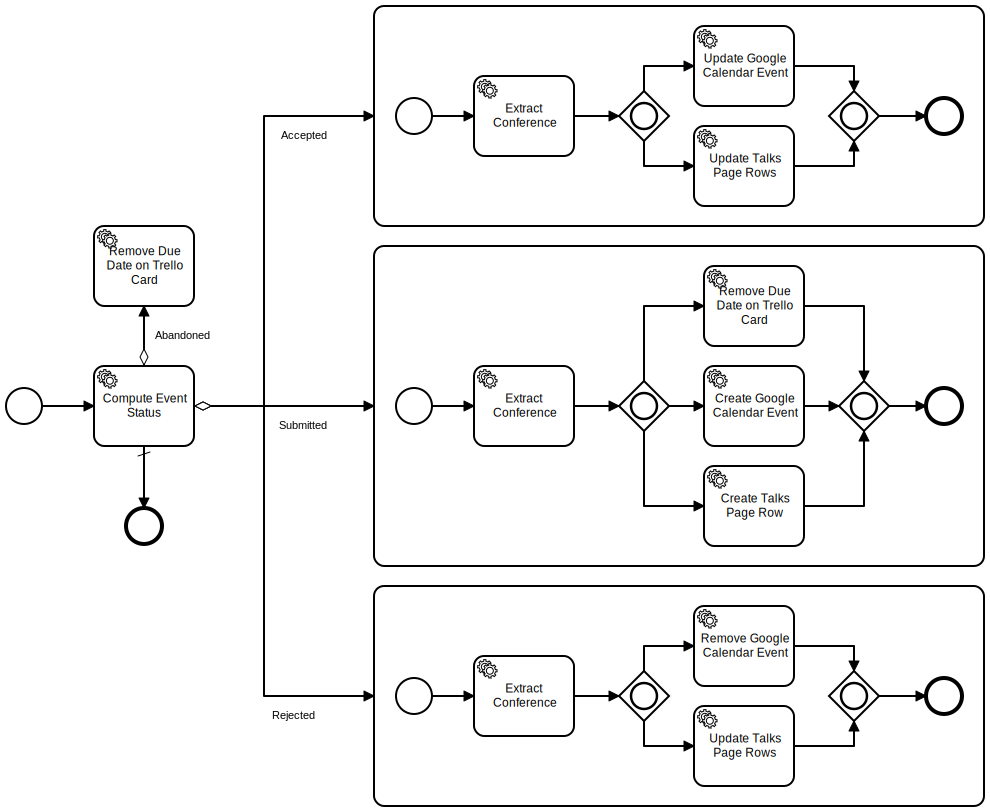

= Conference automation tool

This tools aims to simplify the administrative tasks around conference submission.
It's based on:

* Kotlin
* Spring Boot
* Camunda BPM

The workflow is the following:

== Properties

The application relies on the following properties.
As it uses Spring Boot, they can be passed in any way Spring Boot supports.

=== Required properties

[options="header,autowidth"]
|===

| Property | Description

| `application.trello.boardShortLink`
| Get it from the URL https://trello.com/b/<boardShortLink>/conferences

| `application.trello.boardId`
| Get it by appending `.json` to the board URL.
The `id` will be found in the returned JSON data.

| `application.trello.key`
| Get it on https://trello.com/app-key/[Trello^]

| `application.trello.token`
| Create a token by following https://developers.trello.com/page/authorization[those instructions^]

| `application.google.sheetId`
| Get if from the URL https://docs.google.com/spreadsheets/d/<sheetId>/edit#gid=0

| `application.google.calendarId`
| Click on the menu:Settings and sharing[] menu in the Google Calendar list.
Search for the field named "Calendar ID"

| `application.google.clientEmail`
| Create a service account on the https://cloud.google.com/compute/docs/access/create-enable-service-accounts-for-instances[Google Cloud console^].
Download its associated credentials file in JSON.
Search for the `email` field

| `application.google.privateKeyId`
| Create a service account on the https://cloud.google.com/compute/docs/access/create-enable-service-accounts-for-instances[Google Cloud console^].
Download its associated credentials file in JSON.
Search for the `private_key_id` field

| `application.google.privateKey`
| Create a service account on the https://cloud.google.com/compute/docs/access/create-enable-service-accounts-for-instances[Google Cloud console^].
Download its associated credentials file in JSON.
Search for the `private_key` field

|===

=== Optional properties

[options="header,autowidth"]
|===

| Property | Description | Default value

| `application.speaker`
| Name used in Google Sheets
| `Nicolas Frankel`

| `application.trello.ips`
| List of white-listed IPs from which webhooks requests will be accepted.
They should belong to https://developers.trello.com/page/webhooks#section-webhook-sources[Trello^].
a|
- `107.23.104.115`
- `107.23.149.70`
- `54.152.166.250`
- `54.164.77.56`
- `54.209.149.230`

|===